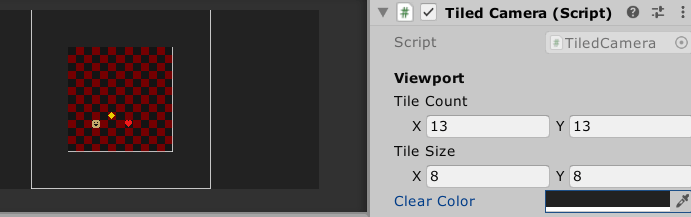

[](https://openupm.com/packages/com.sark.tiled_camera/)
# Tiled Camera 

A simple utility for setting up a pixel perfect camera sized to a specific number and size of "tiles" in your viewport. It also lets you set the clear color for outside the viewport:



#### Important
 - Requires URP.
 - The delayed response to the viewport changes in the preview is from running in the editor. Response is immediate in game.
 - This is just a wrapper around Unity's built in "PixelPerfectCamera" and all the same restrictions from that component apply.
 
## How to Install

##### Via [OpenUPM](https://openupm.com/):
```
npm install -g openupm-cli
openupm add com.sark.tiled_camera
```

##### Via the Package Manager (Install via git url...):
`
https://github.com/sarkahn/tiled_camera#upm
`

##### Via the repo (Clone the master branch):
`https://github.com/sarkahn/tiled_camera.git` 